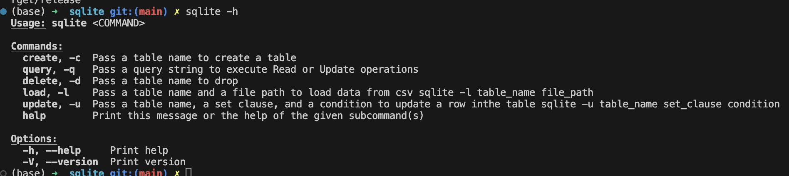
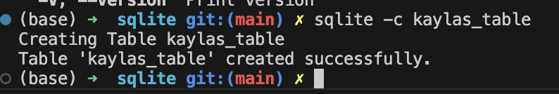
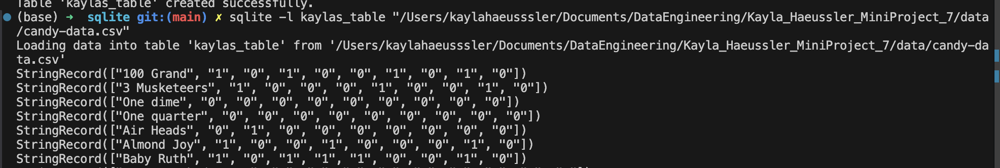
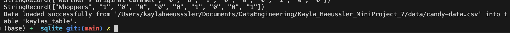
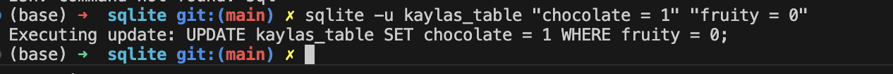
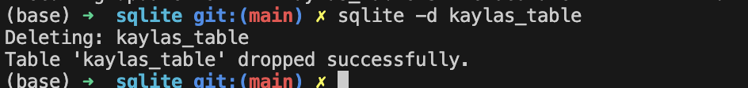

# Kayla_Haeussler_MiniProject_7

IDS 706: Mini Project 7  
Create a command line tool using Rust  
Kayla Haeussler


## Installing and Using this Tool
First, ensure your rust environment is already set up.   

### clap, rusplite and csv
Run the following in your terminal, this will make changes to the Cargo.toml file. 
* cargo add clap --features derive
* cargo add rusqlite
* cargo add csv

### Using this tool
In the lib.rs file I have created functions that will execute Create, Read, Update and Delete functionality of SQL queries, from the command line. These queries can be run from the command line using the following commands: 


We need to establish the projects release folder by running an export PATH command, adapted to your individual file paths. On my machine it looks like this:  
``` export PATH=$PATH:/Users/kaylahaeusssler/Documents/DataEngineering/Kayla_Haeussler_MiniProject_7/sqlite/target/release```
### Create

### Load


### Update

### Delete
