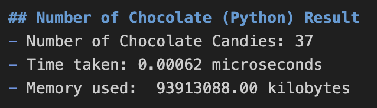
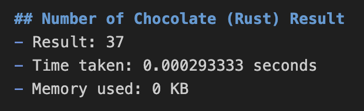

# Kayla_Haeussler_MiniProject_8

IDS 706: Mini Project 8  
Rewrite a Python Script in Rust  
Kayla Haeussler  
[](https://github.com/nogibjj/Kayla_Haeussler_MiniProject_8/actions/workflows/rustCICD.yml)  

[](https://github.com/nogibjj/Kayla_Haeussler_MiniProject_8/actions/workflows/pythonCICD.yml)  

## Assignment Requirements
* Take an existing Python script for data processing
* Rewrite it in Rust
* Highlight improvements in speed and resource usage

For this assignment I used the candy-data.csv data that I have used on previous assignments, from the ```fivethirtyeight``` repository, that contains candy power ranking data.  
My Python and Rust scripts sum the ```chocolate``` column of my data set, which is a binary column indicating whether or not the given candy contains chocolate. By summing this column, we see how many candies in our data set contain chocolate. This simple function allows us to effectively compare performance between Rust and Python.  

## Differences in Speed & Resource Usage
### Python
  

### Rust
  

## Findings
